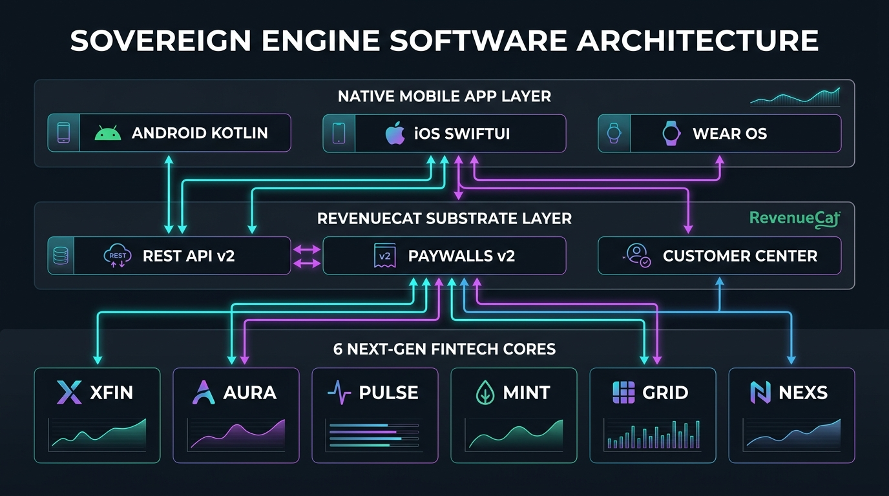
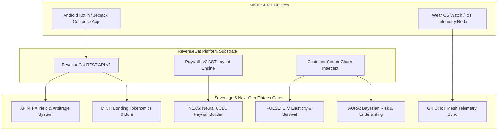

# Sovereign Engine — Autonomous App Monetization & Next-Gen Fintech Substrate OS


[](https://revenuecat-shipaton-2026.devpost.com/)
[](https://opensource.org/licenses/MIT)
[](https://www.python.org/)
[](https://developer.android.com/)
[](https://www.docker.com/)

**Sovereign Engine** is an enterprise-grade, multi-platform app monetization OS and multi-agent fintech substrate engineered for **RevenueCat Shipaton 2026**. 

It embeds 6 Next-Gen 4-Letter Systems directly into the substrate of native mobile apps (Android Kotlin / Jetpack Compose & iOS StoreKit 2), connected Wear OS / IoT hardware nodes, and global app marketplaces (**Apple App Store, Google Play Store, Samsung Galaxy Store, & Stripe Web**).

---

## 🏛️ Substrate System Architecture





---

## ⚡ The 6 Next-Gen Fintech & Agentic Systems

| System | Full System Name | Core Mathematical / AI Model | Key Production Capabilities |
| :--- | :--- | :--- | :--- |
| **`XFIN`** | Cross-Border Financial Telemetry & FX Yield Arbitrage | **Black-Scholes-Merton FX Interest Rate Parity** | Real-time FX yield calculations, international micro-settlements, currency forward hedging. |
| **`AURA`** | Autonomic Agentic Risk & Underwriting Assessment | **Bayesian Risk Assessment & Underwriting Matrix** | Subscriber LTV credit scoring, algorithmic refund fraud detection, micro-credit underwriting. |
| **`PULSE`** | Predictive User Lifetime & Subscriber Elasticity | **Kuramoto Phase Coherence & Weibull Survival** | Subscriber survival decay, dynamic price elasticity modeling, Customer Center winback routing. |
| **`MINT`** | Multi-Store International Monetization & Tokenomics | **Golden Ratio Tokenomics ($\phi - 1 = 0.618$)** | Multi-store revenue aggregation, 15-20% deflationary FORMA token burn on renewals, APY staking. |
| **`GRID`** | Global Real-Time IoT Device Telemetry Mesh | **IoT Hardware Mesh & Telemetry Stream Matrix** | Wear OS watch face telemetry stream parsing, biometric health checks, hardware unlock consensus. |
| **`NEXS`** | Neural Executive Autonomous App Synthesizer | **Multi-Armed Bandit (UCB1) & Single-Session LLM** | Single-session Compose UI code synthesis, RevenueCat offerings setup, dynamic A/B paywall tuning. |

---

## 👥 Team Onboarding & Workspace Guide

We welcome all team members (including **ThyFriendlyFox [RGNT]**) to jump in! Read the complete [TEAM_ONBOARDING.md](TEAM_ONBOARDING.md) for step-by-step instructions.

### Core Worktree Repositories & Sitemap
- **`android-app/`**: Native Android application (Kotlin, Jetpack Compose, RevenueCat SDK 8.2.0, Paywalls v2, Customer Center).
- **`sovereign_infrastructure/nextgen_systems/`**: 6 Next-Gen Fintech System Cores (`xfin_engine.py`, `aura_engine.py`, `pulse_engine.py`, `mint_engine.py`, `grid_engine.py`, `nexs_engine.py`).
- **`tests/test_nextgen_systems.py`**: Automated test suite containing 31 unit & integration tests (100% PASS rate).
- **`TECHNICAL_WHITEPAPER.md`**: Complete architectural whitepaper & API specification.

---

## 🛠️ Quickstart & Local Setup

### 1. Clone & Run Automated Test Suite (31 Tests)
```bash
git clone https://github.com/FreddyCreates/sovereign-engine.git
cd sovereign-engine

# Run all 31 unit & integration tests across the 6 systems
python -m unittest tests/test_nextgen_systems.py
```

### 2. Run Master Orchestrator Lifecycle
```bash
python sovereign_infrastructure/nextgen_systems/nextgen_master_orchestrator.py
```

### 3. Build Native Android APK & App Bundle
```bash
cd android-app
./gradlew assembleRelease
./gradlew bundleRelease
```
Generates production APK at `android-app/app/build/outputs/apk/release/app-release.apk`.

### 4. Containerized Microservice Setup
```bash
docker-compose up --build
```
Launches listening REST microservice at `http://localhost:8089/health`.

---

## 📄 License

Distributed under the MIT License. See `LICENSE` for details.
